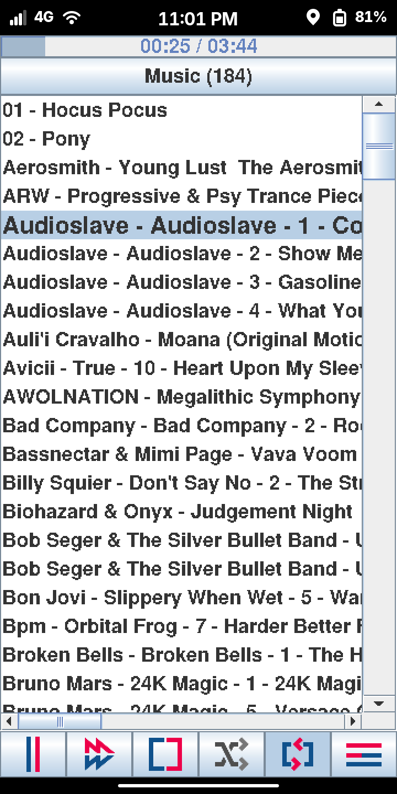
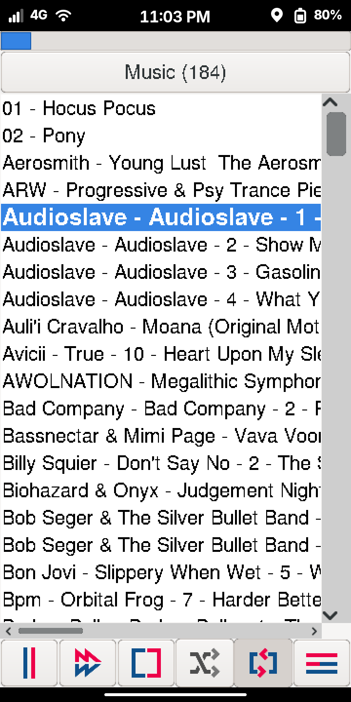
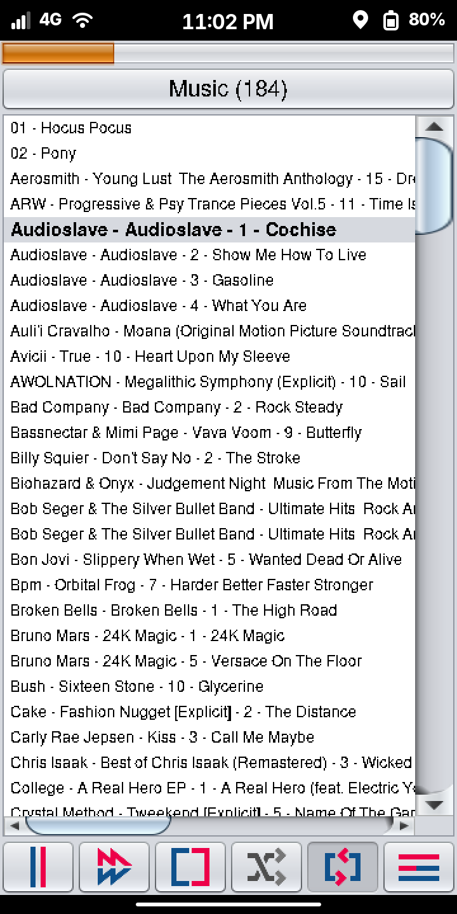
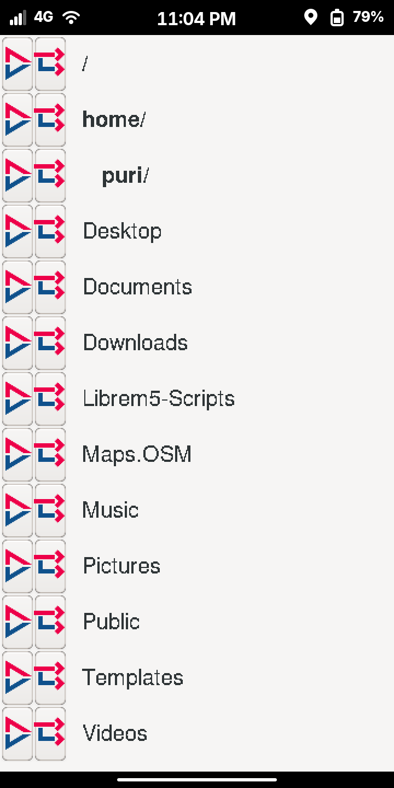
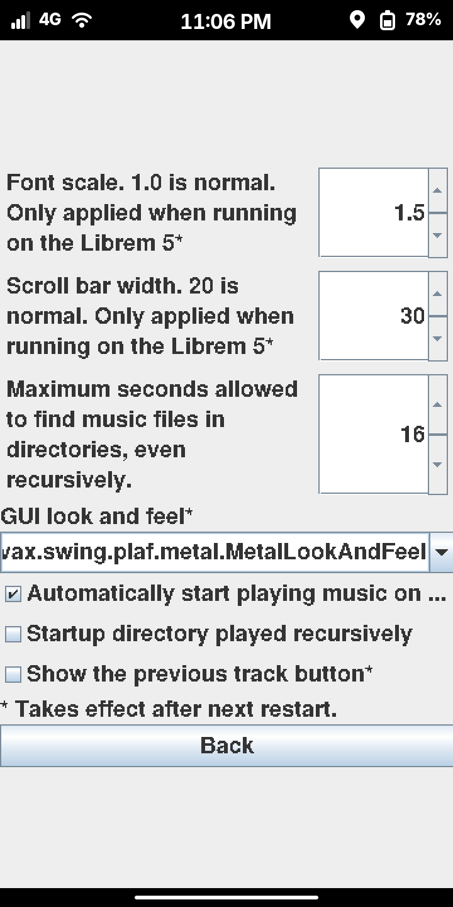
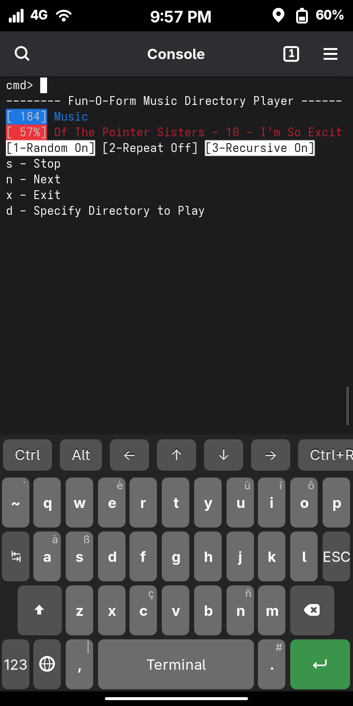
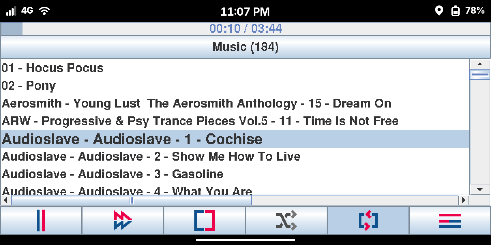

#  Music Directory Player - Java

This application plays local music files. It does not read MP3 tags nor does it create database for searching your collection. Instead it does only one thing, plays all the music files in whatever directory you specify. You may have it play the files in the current directory (not recursive) or include all the music files in any sub-directories (recursive).

## Screenshots
<table>
	<tr align="center">
		<td>Metal Look and Feel<br />The default</td>
		<td>GTK Look and Feel</td>
		<td>Nimbus Look and Feel</td>
	</tr>
	<tr align="center">
		<td></td>
		<td></td>
		<td></td>
	</tr>
	<tr align="center">
		<td>Directory Picker</td>
		<td>Options</td>
		<td>Command Line Interface</td>
	</tr>
	<tr align="center">
		<td></td>
		<td></td>
		<td></td>
	</tr>
	<tr align="center">
		<td colspan=3">Landscape</td>
	</tr>
	<tr align="center">
		<td colspan=3"></td>
	</tr>
</table>

## Fun-o-form Approach
This app is part of the Function Over Form (Fun-O-Form) organization which focuses on:
* Minimal dependencies
* Minimal hardware requirements
* Prioritize functionality over aesthetics

## Features
1. A command line user interface
2. A graphical user interface
3. Control via MPRIS DBus - allows controlling the player through Bluetooth devices many Linux built-in media controls (lock screen, system tray widgets)

## Target Platform
This application is written specifically for the **Librem 5** Linux phone running Phosh on PureOS or PostmarketOS. Let's face it, if you have a keyboard+mouse and a big screen, there are numerous other local media players you could use.

As a Java application this will run on a variety of platforms not just the Librem 5. This will probably work fine on Mac or Windows. But it is not tested on those platforms. Here are some considerations for using non-Linux platforms.

1. The CLI utilizes ANSI escape sequences to update text in place. Windows consoles typically don't support these escape sequences (aside from mingwin) thus the CLI would be very annoying to use on Windows.
2. The install and launcher scripts will not work on Windows, even though the app itself should work fine.

## Related Projects
1. Music Dir Player (Rust) - This Java application was also written as a RUST application. The expectation is the Rust application will provide the same capability while consuming fewer system resources. However I am learning Rust as I go and progress has been slow. I developed this Java application to utilize while I keep developing the Rust version. As a benefit, this allows conducting an apples-to-apples comparison of the two apps' overall performance.

## Usage

### Installation
1. Ensure you have a Java JRE installed. It cannot be a *headless* version.
   * PureOS (Debian-based): `sudo apt install openjdk-17-jre`
   * PostmarketOS (Alpine-based): `sudo apk add openjdk25-jre`
2. Download the latest release onto your device.
   ```
   wget github.com/fun-o-form/music-dir-player-java/releases/latest/download/music-dir-player.zip
   ```
3. Extract the zip then run the installer
  ```
  unzip music-dir-player.zip -d music-dir-player
  cd music-dir-player
  ./install.sh
  ```
4. Launch the application using your graphical application list. It shows up as **Music Dir Player**

### Choosing the GUI or CLI
This app provides both graphical and command line interfaces. You can run either, or both, by specifying a command line argument.
| Example | Outcome |
| -- | -- |
| ./launch-mdp-java.sh | Runs the CLI. |
| ./launch-mdp-java.sh --gui | Runs the GUI. This is how the installed desktop entry launches this app. |
| ./launch-mdp-java.sh --both | Runs the CLI and GUI. |

### Logs
This app includes a default logging configuration file that writes logs to ./music-dir-player-java.log. This file is truncated every time the app is launched so no log file maintenance is required.

You may override the the build in logging configuration file by specifying your log config file as a command line argument: `-Djava.util.logging.config.file=your-log.properties`. Note however that writing logs to the console renders the CLI unusable.

## Contributing

Submit a pull request. Don't for get to check for new code quality issues.
1. [SonarCloud](https://sonarcloud.io/projects) 

## Open Source usage

| What | How Used |
| -- | -- |
| [Java Stream Player (Library)](https://github.com/goxr3plus/java-stream-player/tree/master) | The back end for playing music files. | 
| [Stencil Media Controls Icons](https://icons8.com/icons/set/media-controls--style-stencil) | Icons used on the GUI. |

## Profiling
Profiling is done using Yourkit Java Profiler.


YourKit supports open source projects with innovative and intelligent tools 
for monitoring and profiling Java and .NET applications.
YourKit is the creator of <a href="https://www.yourkit.com/java/profiler/">YourKit Java Profiler</a>,
<a href="https://www.yourkit.com/dotnet-profiler/">YourKit .NET Profiler</a>,
and <a href="https://www.yourkit.com/youmonitor/">YourKit YouMonitor</a>.